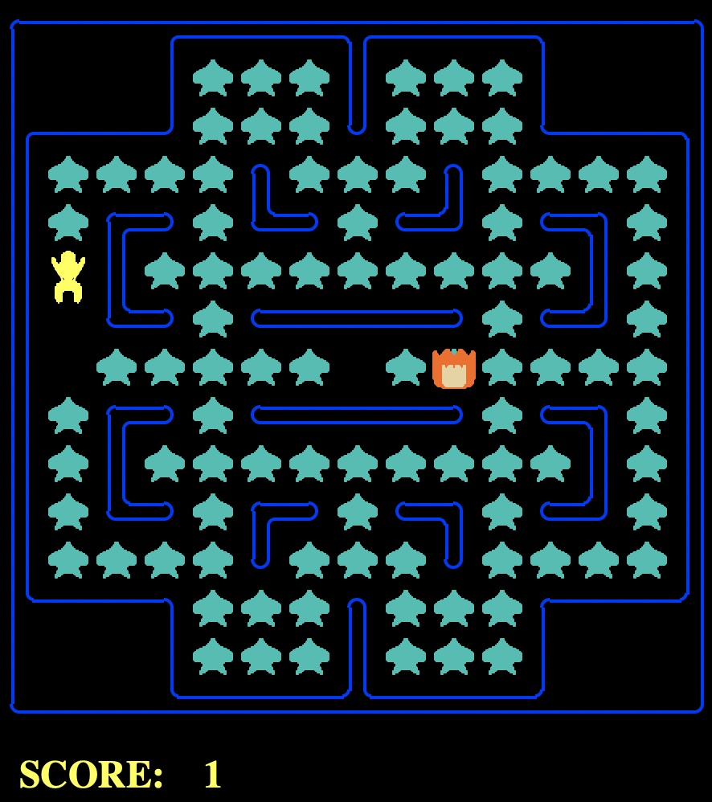

# A Pacman env


| property          | value                                              |
|-------------------|----------------------------------------------------|
| Action Space      | Discrete(5, int)                                   |
| Observation Shape | Box(60, 60) for gray <br/> Box(15,15) for tinygrid |
| Observation Range | (0, 1)                                             |
| Import Statement  | `gym.make("Pacman-v0")`                            |

This is [Gym](https://www.gymlibrary.dev) compatible environment based on the Pac-Man Project from [UC Berkeley CS188](http://ai.berkeley.edu). 

States can be rendered in one of the two render modes: gray and tinygrid. 
If the render mode is gray, then the state has 60 x 60 pixels. If the render mode is tinygrid, then 
the state is a 15 by 15 matrix in which each value represents the agent, a ghost, a wall, food or empty.  

The reward is -0.1 every time step and +1 for every food eaten. If all foods are eaten, the pacman gets a reward of +10 
and the episode ends successfully. The game finishes unsuccessfully if the pacman does not eat all foods within 200 steps, or if
it crashes a ghost. 

The map in all episodes are the same.



## installation

```shell script
pip install -e .
```

## Configure the environment
Parameters for the environment.
  - `seed`: the seed of the environment.
  - `render_or_not`: Boolean indicating whether to render the game.
  - `render_mode`:  determines the state space. If the value is `gray` then the states are in grayscale. 
If the value is `tinygrid`, then the state is a 15 by 15 matrix in which each value represents the agent, 
a ghost, a wall, food or empty. If the value is `dict`, then the state is a dict of `gray` and `tinygrid`. 
  - `move_ghosts`: Boolean determine if the ghosts can move around. 
  - `stochasticity`: probability of the agent slipping when executing an 
action. For example, when the agent chooses to move up, it moves left with a 
probability of `stochasticity`, moves right with a probability of `stochasticity` 
and moves up with a probability of (1 - 2 * `stochasticity`). If the value is 0.0, 
then the agent does not slip.


## Configure the environment (for the future) 
Right now if you want to change the environment, you have to dive in the code base. 
I plan to make the following things easier in the future. 

- Custom layouts (maps)
- Custom reward structure
- Random initial locations of the pacman and the ghosts at the beginning of each episode
- Interactive control for the users to play with the environment using the keyboard